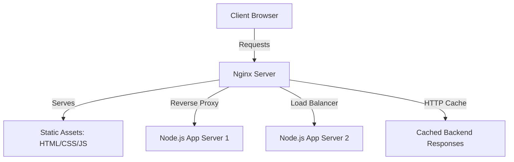

# Introduction to Nginx

**Nginx** (pronounced "engine-x") is a high-performance, open-source web server, reverse proxy, load balancer, mail proxy, and HTTP cache. Originally written by Igor Sysoev in 2004, it was designed specifically to address the **C10k problem**—the challenge of handling 10,000 concurrent connections on a single server.

---

## Key Roles of Nginx

In modern web architecture, Nginx typically plays one or more of the following roles:



### 1. Web Server
Nginx excels at serving static content (HTML, CSS, JS, images, videos) extremely fast and with minimal CPU and memory consumption.

### 2. Reverse Proxy
Instead of exposing your application servers (like Node.js, Python, or Go) directly to the internet, Nginx sits in front of them. It accepts incoming requests and forwards them to the appropriate backend server. This protects backend servers from direct exposure and simplifies security configurations.

### 3. Load Balancer
Nginx can distribute incoming network traffic across multiple backend servers. This prevents any single server from becoming a bottleneck, ensures high availability, and allows you to scale your application horizontally.

### 4. SSL/TLS Terminator
Nginx can handle the decryption of SSL/TLS traffic from clients before passing the unencrypted requests to backend servers (which run on local networks). This offloads cryptographic workloads from application servers.

### 5. API Gateway / Router
Nginx can route incoming client requests to different microservices based on the URL path or headers (e.g., `/api/v1/users` goes to the User Service, while `/static` goes to storage).

---

## Why is Nginx So Fast? (The Architecture)

Traditional web servers like Apache historically used a **process-per-connection** or **thread-per-connection** model. When thousands of clients connect, the server has to spin up thousands of processes/threads, leading to massive memory usage and CPU context-switching overhead.

Nginx uses a different architecture:
- **Event-Driven & Asynchronous:** A single Nginx worker process can handle thousands of concurrent connections simultaneously.
- **Non-blocking I/O:** Worker processes don't wait for network or file I/O operations to complete. Instead, they handle other requests and return to the waiting operations when notifications arrive.
- **Low Memory Footprint:** Nginx requires very little memory per connection, making it highly efficient even under heavy traffic spikes.

---

## Common Configuration Example

Below is a simple configuration block demonstrating Nginx acting as a reverse proxy with static file fallback:

```nginx
server {
    listen 80;
    server_name example.com www.example.com;

    # Serve static assets directly
    location /static/ {
        root /var/www/my-app;
        expires 30d;
        add_header Cache-Control "public, no-transform";
    }

    # Forward all other requests to a Node.js app running on port 3000
    location / {
        proxy_pass http://127.0.0.1:3000;
        proxy_http_version 1.1;
        proxy_set_header Upgrade $http_upgrade;
        proxy_set_header Connection 'upgrade';
        proxy_set_header Host $host;
        proxy_cache_bypass $http_upgrade;
    }
}
```
