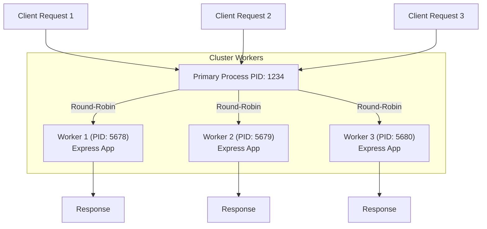

# Node.js Clustering

Node.js runs in a single-threaded event loop. By default, even if you run a Node.js server on a machine with 16 CPU cores, it will only utilize a single core. This single-threaded nature is highly efficient for I/O-bound operations, but it limits CPU utilization for compute-heavy tasks and scaling.

**Clustering** is a built-in Node.js feature that allows you to easily create a cluster of child processes (workers) that all share the same server ports and distribute the incoming load across multiple CPU cores.

---

## 1. Visual Architecture

Here is how clustering works conceptually. The **Primary Process** acts as a load balancer/master controller, while the **Worker Processes** handle the actual client requests.



---

## 2. Primary vs. Worker Processes

When utilizing the `node:cluster` module, your code runs in two different roles:

### Primary Process (`cluster.isPrimary` / `cluster.isMaster`)
- **Responsibility**: It is the coordinator. It does **not** listen for or handle HTTP/TCP requests directly.
- **Action**: It detects the number of available CPU cores and spawns (**forks**) worker processes using `cluster.fork()`.
- **Process Management**: It listens for worker exits (crashes) and can spawn new ones to maintain system health.

### Worker Processes (`else` block)
- **Responsibility**: They are individual instances of your application running in their own threads/processes.
- **Action**: They initialize the HTTP server (e.g., Express) and handle incoming requests.
- **Port Sharing**: Even though they all try to call `app.listen(5000)`, Node.js intercepts this call and routes the traffic through the primary process, preventing the `EADDRINUSE` (Address already in use) error.

---

## 3. Walkthrough of `server.js`

Here is how your [server.js](file:///d:/Nodejs/clusters/server.js) implements clustering:

```javascript
const cluster = require('node:cluster');
const http = require('http');
const numCPUs = require('os').cpus().length; // Get the number of CPU cores
const express = require('express');

if (cluster.isPrimary) {
    // 1. Spawns one worker process per CPU core
    for (let i = 0; i < numCPUs; i++) {
        cluster.fork();
    }
} else {
    // 2. Worker processes execute this block and run the Express app
    const app = express();
    const port = 5000;

    app.get('/', (req, res) => {
        // Each worker prints its own PID (Process ID)
        return res.json({ message: `Hello from Express Server  ${process.pid}` })
    })

    app.listen(port, () => {
        console.log(`Listening on port ${port}`);
    })
}
```

> [!NOTE]
> If your CPU has 8 cores, `numCPUs` will be `8`. The primary process will call `cluster.fork()` 8 times, starting 8 separate instances of Node.js running the `else` block. You will see `Listening on port 5000` logged 8 times in the terminal.

---

## 4. Key Benefits of Clustering

* **Performance & Scale**: Fully utilizes all CPU cores of the server, significantly increasing throughput (requests per second).
* **Fault Tolerance & High Availability**: If one worker process crashes due to an unhandled exception, other workers keep serving traffic. You can configure the Primary process to immediately spawn a replacement worker when one dies:
  ```javascript
  cluster.on('exit', (worker, code, signal) => {
      console.log(`Worker ${worker.process.pid} died. Spawning a new one...`);
      cluster.fork();
  });
  ```
* **Zero-Downtime Reloads**: You can restart workers one by one during a deployment, ensuring that your application is always online.

---

## 5. Important Caveats & Limitations

> [!WARNING]
> **No Shared Memory/State**
> Since each worker is a separate OS process, they do **not** share memory. 
> - If you store session data or cache in local memory (e.g., in a JavaScript object/variable), a subsequent request routed to a different worker will **not** find that state.
> - **Solution**: Use an external state store, such as **Redis** or a database, for sessions and caching.

> [!IMPORTANT]
> **Memory Usage**
> Every worker is a separate instance of the Node.js runtime, which has a baseline memory overhead (typically 30MB+ per instance). Spawning too many workers can exhaust server memory.

---

## 6. PM2: A Production Alternative

While the native `node:cluster` module is excellent, writing custom management logic for worker monitoring can be tedious. In production, developers often use **PM2** (Process Manager 2), which handles clustering automatically without code modifications.

Instead of writing `cluster.fork()` in your code, you run your standard single-process `app.js` using:
```bash
pm2 start app.js -i max
```
PM2 will automatically spin up workers equal to the number of CPUs and manage their lifecycles for you.

---

## 7. Load Balancing
- **Linux/macOS**: Node.js uses round-robin load balancing, distributing incoming TCP connections evenly among workers.
- **Windows**: Workers accept connections independently, meaning the same process might handle multiple requests while others remain idle depending on OS resource scheduling.

---

## 8. Worker Lifecycle & Fault Tolerance

In production, performance is only half the story. The primary benefit of clustering is **resilience and fault tolerance**. If a single worker crashes (e.g., due to an unhandled exception or database connection timeout), the primary process can immediately spin up a new worker to take its place.

### The Worker Lifecycle Events
The `cluster` module emits several lifecycle events on the primary process:

1. **`fork`**: Emitted when a new worker is spawned.
2. **`online`**: Emitted when the worker starts running code and is ready.
3. **`listening`**: Emitted when the worker calls `listen()` and is officially receiving connections on the shared port.
4. **`disconnect`**: Emitted when the IPC channel between the primary and worker is disconnected (often right before exit).
5. **`exit`**: Emitted when the worker process terminates (either gracefully or due to a crash).

```javascript
// Example of listening to these events in the Primary Process:
cluster.on('fork', (worker) => {
    console.log(`[Primary] Worker ${worker.id} has been forked.`);
});

cluster.on('online', (worker) => {
    console.log(`[Primary] Worker ${worker.id} is online and ready.`);
});

cluster.on('listening', (worker, address) => {
    console.log(`[Primary] Worker ${worker.id} is listening on port ${address.port}.`);
});

cluster.on('exit', (worker, code, signal) => {
    console.log(`[Primary] Worker ${worker.process.pid} died (code: ${code}, signal: ${signal}).`);
    console.log('[Primary] Spawning a replacement worker...');
    cluster.fork(); // Auto-respawn
});
```

---

### Graceful Shutdown: `worker.disconnect()` vs. `worker.kill()`

When scaling down or restarting servers, you want to shut down workers without cutting off active user requests. 

#### `worker.disconnect()` (Graceful)
- **What it does**: Disconnects the IPC channel between the primary and the worker. It stops the worker from accepting **new** connections on the shared port.
- **Why it is graceful**: Existing HTTP connections/requests currently being processed by the worker are allowed to finish. Once all connections are closed and no more work is pending, the worker process exits naturally.
- **Usage**:
  ```javascript
  // On the primary process:
  worker.disconnect();
  ```

#### `worker.kill()` (Forced)
- **What it does**: Forcibly terminates the worker process immediately (usually sends a `SIGTERM` or `SIGKILL` signal).
- **Why it is dangerous**: Any active requests handled by that worker are immediately severed, resulting in `502 Bad Gateway` or dropped connection errors for users.
- **Usage**:
  ```javascript
  // On the primary process:
  worker.kill(); // or worker.destroy()
  ```

---

### Implementing a Graceful Shutdown Pattern

A robust production cluster combines both: it initiates a graceful shutdown, but enforces a timeout after which it forcibly kills the worker if it hangs.

#### In the Worker Process:
```javascript
// Handle shutdown signals (e.g., SIGTERM sent by PM2 or Primary)
process.on('SIGTERM', () => {
    console.info(`[Worker ${process.pid}] SIGTERM received. Starting graceful shutdown...`);
    
    // Stop accepting new connections
    server.close(() => {
        console.log(`[Worker ${process.pid}] Closed all connections. Exiting.`);
        process.exit(0);
    });

    // Force shutdown after 10 seconds if connections hang
    setTimeout(() => {
        console.error(`[Worker ${process.pid}] Forced shutdown due to timeout.`);
        process.exit(1);
    }, 10000);
});
```

---

## 9. Inter-Process Communication (IPC)

Because workers are completely separate OS processes, they **do not share memory**. If a worker receives an HTTP request, other workers and the primary process have no direct access to variables or state inside that worker.

To allow coordination, Node.js provides a built-in **IPC (Inter-Process Communication)** channel. This allows the primary process and worker processes to send JSON-serializable messages back and forth.

### Communication Flow

- **Primary to Worker**: 
  - Send: `worker.send(message)`
  - Receive (in Worker): `process.on('message', callback)`
- **Worker to Primary**:
  - Send: `process.send(message)`
  - Receive (in Primary): `worker.on('message', callback)` or `cluster.on('message', callback)`

---

### Practical Example: Aggregating Request Stats

A common use case for IPC in clustering is aggregating stats (like total requests served) across all workers.

#### 1. In the Worker Process (`app.js` / worker context)
Whenever the worker handles a request, it sends a message notifying the primary process.

```javascript
app.get('/', (req, res) => {
    // Notify primary that a request was handled
    if (process.send) {
        process.send({ type: 'REQUEST_HANDLED' });
    }
    return res.json({ message: `Hello from Worker ${process.pid}` });
});
```

#### 2. In the Primary Process (`server.js`)
The primary process receives these messages and updates a central counter.

```javascript
let totalRequests = 0;

// Spawns workers and listens to messages from them
for (let i = 0; i < numCPUs; i++) {
    const worker = cluster.fork();

    worker.on('message', (msg) => {
        if (msg.type === 'REQUEST_HANDLED') {
            totalRequests++;
            console.log(`[Primary] Total requests processed: ${totalRequests}`);
        }
    });
}
```

> [!NOTE]
> Under the hood, messages sent via IPC are serialized to JSON, transmitted across the OS pipe/IPC channel, and deserialized back into objects on the receiving end. This channel is not designed for transferring massive data sets at high frequency, but is perfect for commands, state syncs, and status reports.

---

## 10. Why Not Just a Single Process? (Clustering vs. Libuv Threads)

It is a common question: **"If Node.js already uses multiple threads under the hood via `libuv` (which run on separate CPU cores), why do we need clustering?"**

To understand this, we must look at the difference between **JavaScript execution** and **internal OS/asynchronous operations**.

---

### The Bottleneck: The JS Execution Thread
In Node.js, your JavaScript code is executed by the V8 engine on a **single thread**. 
* Any Express route callback, JSON parsing (`JSON.parse`), crypto calculation, loop, or synchronous logic runs entirely on that one thread.
* If a request comes in and executes a heavy JS computation that takes **50ms**, the main thread is completely blocked. No other network requests can be parsed or routed during those 50ms, even if your server has 15 other CPU cores sitting idle.

---

### What Does the Libuv Thread Pool Actually Do?
Libuv does spawn a pool of background threads (defaulting to 4 threads), but they are **restricted** in what they can run:
1. **No JavaScript**: The libuv threads only run compiled C++ code for specific asynchronous tasks. They **cannot** execute your JS routes, Express middleware, or business logic.
2. **Limited Duties**: They are only used for tasks that have no non-blocking OS equivalent:
   - File system operations (`fs`)
   - Cryptographic functions (`crypto`)
   - Compression/Zlib (`zlib`)
   - DNS lookups (`dns.lookup`)

> [!NOTE]
> For Network I/O (handling incoming HTTP/TCP connections), modern operating systems provide native asynchronous APIs (like `epoll` on Linux or `IOCP` on Windows). Node.js uses these directly on the main event loop thread without involving libuv's thread pool.

---

### Comparison Matrix

| Feature | Single Instance (No Cluster) | Cluster (e.g., 8 Workers) |
| :--- | :--- | :--- |
| **JS Thread Count** | **1** (Only one event loop executing JavaScript) | **8** (Eight independent event loops running JS) |
| **Event Loop Blocking** | If one request blocks the event loop, **all** other users wait. | If one worker event loop is blocked, the other **7** workers continue serving requests. |
| **HTTP Request Parsing** | Parsing HTTP headers & routing must happen on a single thread. Capped by how fast one core can process JS. | Multiplied throughput. 8 workers parse headers and execute route logic concurrently. |
| **CPU Core Utilization** | Utilizes **1 core** for JS execution + minor background core usage for file/crypto operations. | Utilizes **all 8 cores** at 100% capacity for JS execution. |
| **Fault Tolerance** | If the process encounters an unhandled exception and crashes, the entire website goes offline. | If one worker crashes, the remaining workers handle requests while the primary process restarts the dead worker. |

